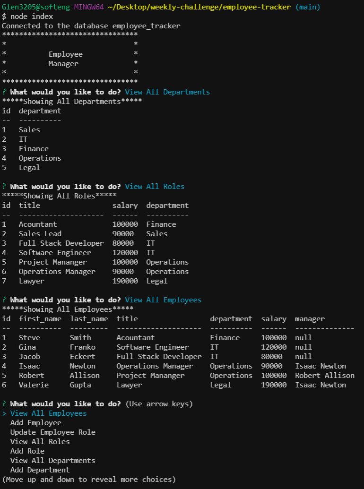
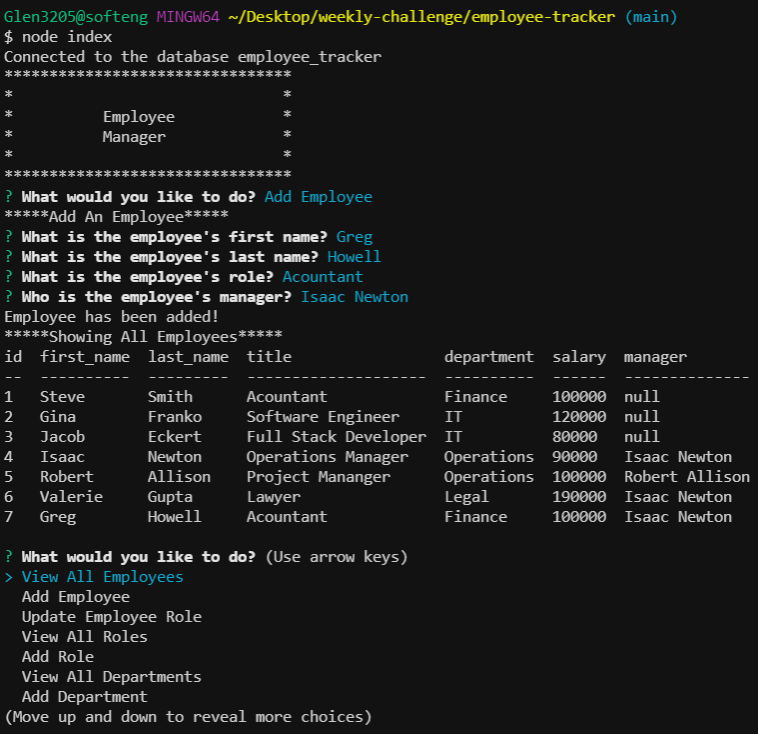

 </a>

<h3 align="center">Employee Tracker</h3>

---

 Keeping track of your employees has never been easier!
      

## 

- [About](#about)
- [Installing](#installing)
- [Usage](#usage)
- [Built With](#built_using)
- [Authors](#authors)
- [Questions](#questions)
- [Screenshots](#screenshots)

## 

Employee tracker is a MySQL database for keeping track of employee data. It is built using Node.js and MySQL. Keeping track of your employees has never been easier.

## 

Clone the repository and run the command npm install. Then the command node index to start the application.

## 

Using Employee Tracker is as simple as navigating through the main menu to select the task you desire and following the prompts.

## 

- MySQL
- Node.js
- Javascript

## 

- [glenluersman](https://github.com/glenluersman)

## 

- Feel free to open an issue or contact me directly at glen.luersman@gmail.com if you have any questions about the repo. You can find more of my work at [glenluersman](https://github.com/glenluersman).

## 

</a>

</a>
